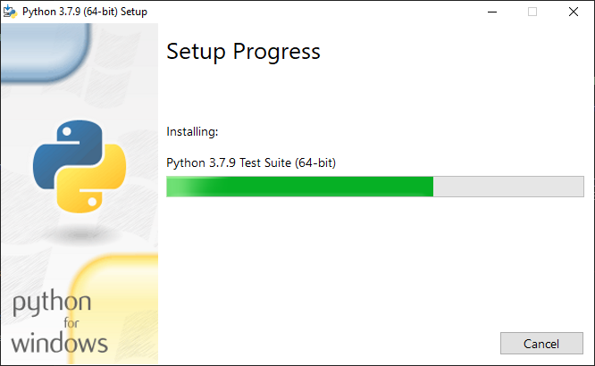

# carracing. gra jasia i taty

# Instalacja Pythona
Ponieważ pygame nie działa z najnowszą wersją pythona trzeba zaintsalować jej starszą wersję. 
Zrobimy to na przykaładzie python 3.7.9.
wejdź na strone:www.python.org .Kliknij na katalog Downloads i wybierz:all releases.

znajdź:python 3.7.9 i naciśnij:Download.

znajdź i ściągnij:Windows x86-64 executable installer.

Uruchom plik instalacyjny.
Wybierz 'Add Python 3.7 to PATH'.
Kliknij 'Install Now'

python się instaluje...

kliknij"close".

wpisz adres"github.com/dariuszmrugala/carracing .kliknij"code"i wybierz "Download ZIP"

otwórz Eksplalator plików, naciśnij prawy klawisz myszy i wybierz"Extract All..."

zaznacz"Show extracted files when complete"i kliknij "Extract"

otworzy się okno z katalogiem gry do kturego musisz wejść.
kliknij 2 razy na folder "carracing-main.

naciśnij Shift i prawy klawisz myszy, i wybierz "Open PowerShell window here"

zainstaluj pygame zero wpisując: python -m pip install pgzero

gdy python się zainstaluje wpisz:python .\pygame1.py

Go!steruj strzałkami(prawo-lewo).Jak przegrasz albo wygrasz wystarczy że naciśniesz spacje abygrać od nowa.

